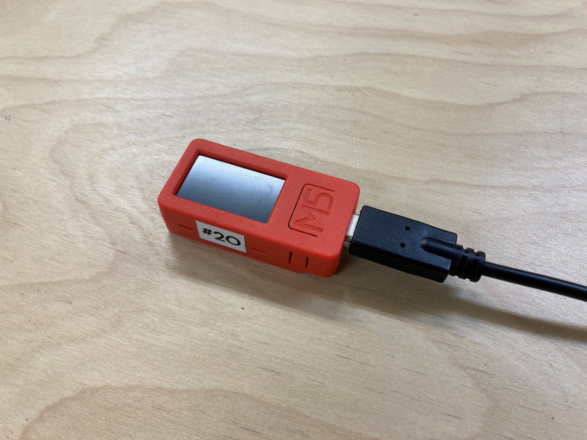
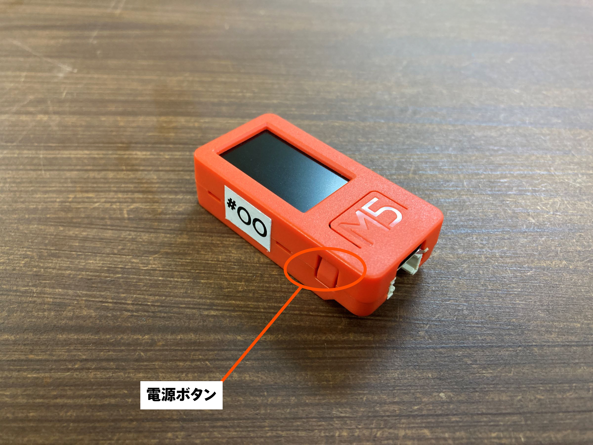
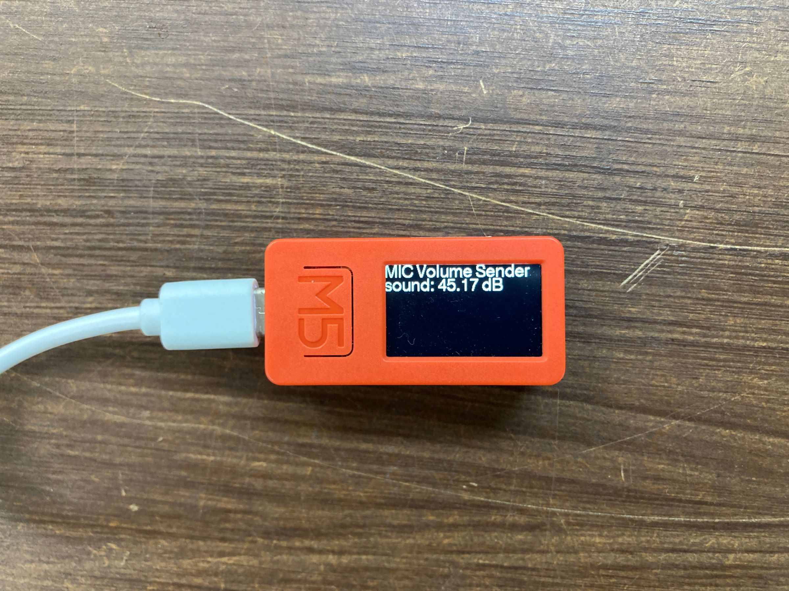
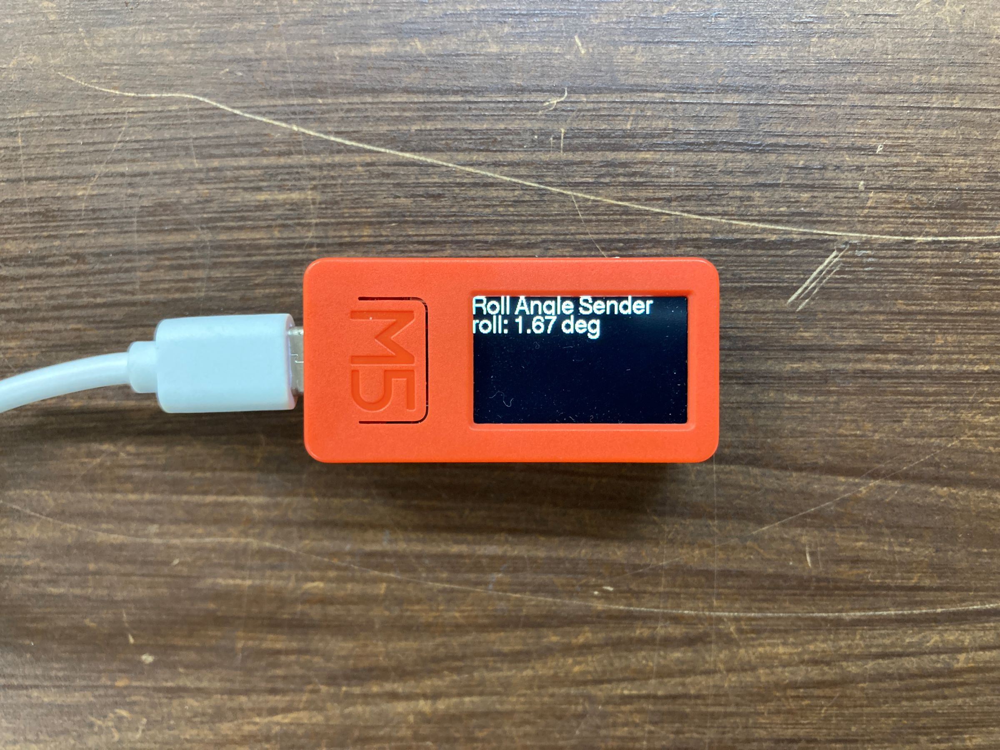
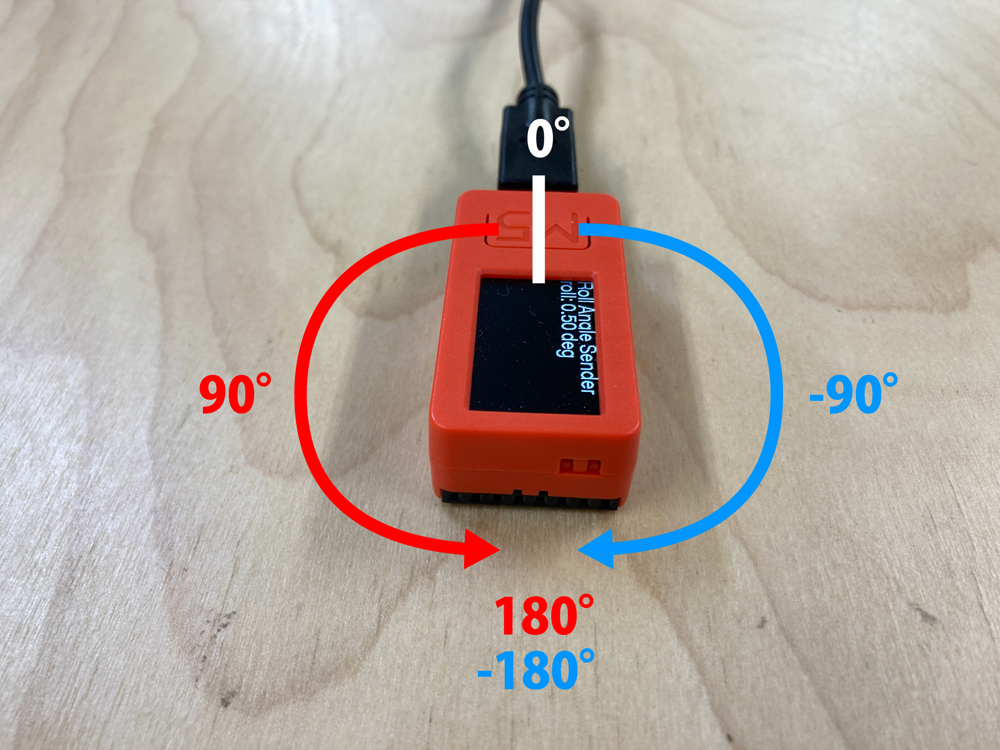

# 音量もしくは傾きセンサの準備方法

## M5StickC PLUSの電源ON
音量もしくは傾きセンサについてはM5StickCPlusに内蔵されているので、外部センサ接続の必要はありません。

モバイルルーターの電源が入ったことを確認したら、M5Stickの電源も入れましょう。
まずは、USBケーブルをM5Stickにも繋げます。給電が始まると、M5Stickは自動的に電源ONになります。

もし、電源が入らなかった場合は、以下の電源ボタンを押して電源を入れてください。

 

M5Stickの電源ボタンは"M5"の文字を正面にして、左側面にあります。 逆側にも似たようなボタンがあるので注意してください。

このボタンを、 **１回押すと電源ON。６秒以上長押しすると電源OFF。** となります。

もし、不具合があった場合は、 M5Stickの電源を切って、再度立ち上げると解決することがあるので、電源の入れ方、切り方は覚えておいてください。

電源が入り、ルーターと正常に通信を開始すると、 M5Stickの画面には、センサの各測定値が表示されます。 
音量、傾きセンサによって表示画面が異なるので以下に分けて説明します。

## 音量センサの場合

音量センサが正常に動き出すと、以下のような画面が表示されます。

- sound : 音量　(単位:dB)

※センサを起動させる時に、周囲で大きな音が発生していると数値がおかしくなる場合があります。その場合は上記の方法で電源を入れ直してください。

## 傾きセンサの場合

傾きセンサが正常に動き出すと、以下のような画面が表示されます。

- roll : 傾きの角度　(単位:deg , 度)

水平なテーブルにM5Stickを置くと0°と表示され、 回転方向によって下の画像のように角度が変化していきます。

この図で、赤い矢印方向に回転させていくと、0°から180°へと数値が増加していきます。 逆に青い矢印方向に回転していくと、0°から-180°へと数値が減少していきます。 センサの値の範囲は１周を-180° ~ 180°で表すので、ディスプレイを赤矢印方向へ回し続け、180°(ディスプレイが真下を向いた状態)を超えると、180°から一気に-180°に数値が切り替わる点があります。